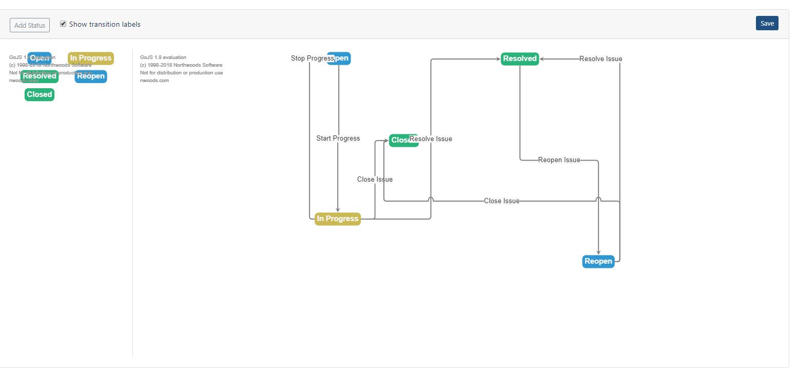

## Laraflow Go - VueJS package for to edit your workflow.
Laraflow Go is a front end package for the Laraflow state machine based on VueJS framework and
GoJS javascript library. You can edit your state machine easy and an elegant way.

[]

## Requirements
The package has a dependency on the Laraflow package. So, before you use this package
do the necessary steps which are on the Laraflow readme file.

You also need a Vue js and go.js to install before you use this package.

## Configuration
The GoJs configuration array need to looks like this:
```php
[
            'property_path' => 'last_state',
            'steps' => [
                [
                    'text' => 'Open',
                    'extra' => [
                        'color' => 'primary',
                        'category' => 'primary',
                        'loc' => '-72.8125 139'
                    ]
                ],
                [
                    'text' => 'In Progress',
                    'extra' => [
                        'color' => 'success',
                        'category' => 'warning',
                        'loc' => '-74.8125 452'
                    ]
                ],
                [
                    'text' => 'Resolved',
                    'extra' => [
                        'color' => 'success',
                        'category' => 'success',
                        'loc' => '280.1875 140'
                    ]
                ],
                [
                    'text' => 'Reopen',
                    'extra' => [
                        'color' => 'primary',
                        'category' => 'primary',
                        'loc' => '433.1875 535'
                    ]
                ],
                [
                    'text' => 'Closed',
                    'extra' => [
                        'color' => 'success',
                        'category' => 'success',
                        'loc' => '54.1875 299',
                    ]
                ]
            ],
            'transitions' => [
                [
                    'from' =>  0,
                    'to' => 1,
                    'text' => 'Start Progress',
                    'extra' => [
                        'fromPort' => 'B',
                        'toPort' => 'T',
                        'points' => [],
                    ],
                    'callbacks' => [
                        'pre' => [],
                        'post' => []
                    ],
                    'validators' => []
                ],
                [
                    'from' => 1,
                    'to' => 0,
                    'text' => 'Stop Progress',
                    'extra' => [
                        'fromPort' => 'L',
                        'toPort' => 'L',
                        'points' => []
                    ],
                    'callbacks' => [
                        'pre' => [],
                        'post' => []
                    ],
                    'validators' => []
                ],
                [
                    'from' => 1,
                    'to' =>  2,
                    'text' => 'Resolve Issue',
                    'extra' => [
                        'fromPort' => 'R',
                        'toPort' => 'L',
                        'points' => []
                    ],
                    'callbacks' => [
                        'pre' => [],
                        'post' => []
                    ],
                    'validators' => []
                ],
                [
                    'from' => 2,
                    'to' =>  3,
                    'text' => 'Reopen Issue',
                    'extra' => [
                        'fromPort' => 'B',
                        'toPort' => 'T',
                        'points' => []
                    ],
                    'callbacks' => [
                        'pre' => [],
                        'post' => []
                    ],
                    'validators' => []
                ],
                [
                    'from' => 3,
                    'to' =>  2,
                    'text' => 'Resolve Issue',
                    'extra' => [
                        'fromPort' => 'R',
                        'toPort' => 'R',
                        'points' => []
                    ],
                    'callbacks' => [
                        'pre' => [],
                        'post' => []
                    ],
                    'validators' => []
                ],
                [
                    'from' => 1,
                    'to' =>  4,
                    'text' => 'Close Issue',
                    'extra' => [
                        'fromPort' => 'R',
                        'toPort' => 'L',
                        'points' => []
                    ],
                    'callbacks' => [
                        'pre' => [],
                        'post' => []
                    ],
                    'validators' => []
                ],
                [
                    'from' => 3,
                    'to' =>  4,
                    'text' => 'Close Issue',
                    'extra' => [
                        'fromPort' => 'R',
                        'toPort' => 'L',
                        'points' => []
                    ],
                    'callbacks' => [
                        'pre' => [],
                        'post' => []
                    ],
                    'validators' => []
                ],

            ],
    ];
```


## Installation

#### Step 1
First you need to install the package via composer:
```php
composer require szana8/laraflow-go
```

#### Step 2
You have to add the GojsAble trait to your Eloquent model which stores the configuration
array and you have to add these two attributes to the append array.
```php
protected $appends = ['goJsObject', 'nodeDataArray', 'validators', 'callbacks'];
```

#### Step 3
You have to add the LaraflowGoServiceProvider to your config/app.php file.

#### Step 4
The next step is to publish the Vue components to your project.
```php
php artisan vendor:publish --tag=laraflow-go-components
```
After this step you can see a laraflow-go.php configuration in the config directory. This file contains
the default state-machine configuration array and some validation rules.

#### Step 5
You need to import the go.js in the app.js file:
```php
import * as go from "gojs";
window.GO = go.GraphObject.make;
```

#### Step 6
If you want to use the designer component you have two options. Import the LaraflowDesigner from the components directgory or register the components to your app.js file in resources/assets/js
```php
Vue.component('laraflow-designer', require('./components/laraflow-go/LaraflowGoDesigner'));
```
The same as the laraflow-transitions component which gives you a dropdown button with all of the steps which are available from the current status.
```php
Vue.component('laraflow-transitions', require('./components/laraflow/laraflow-go/components/LaraflowTransitions'));
```

#### Step 7
Now you can use the component in you blade file:
```php
 <laraflow-designer :configuration="{{ json_encode($laraflow) }}" :endpoint="'{{ route('laraflow.update', $laraflow) }}'"></laraflow-designer>
```
The $laraflow is a Laraflow Eloquent object. The end point is the route of the
controller update function. The save function pass only the configuration attribute
to the controller.

#### Step 8
If you use the transition component, you have to take care of the call the update from the parent component. The transition component returns back a changed event with the status object, when you changed the status. For example:
```php
changed(transition) {
    axios.post('/issue/status/' + this.issue.id + '/' + transition.key).then((response) => {
        // Success
    }).catch((error) => {
        // Catch the error messages
    });
}
```
If you did everything right you can see this editor:


#### Sample project
You can see the "engine" in action here: https://github.com/szana8/larascrum
After you cloned the repository to your local machine and installed all of the composer and npm packaged, run the migration and seed to generate some dummy data for the test.
